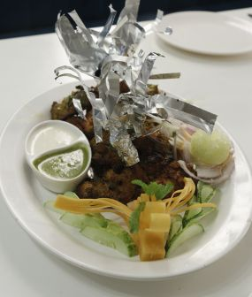
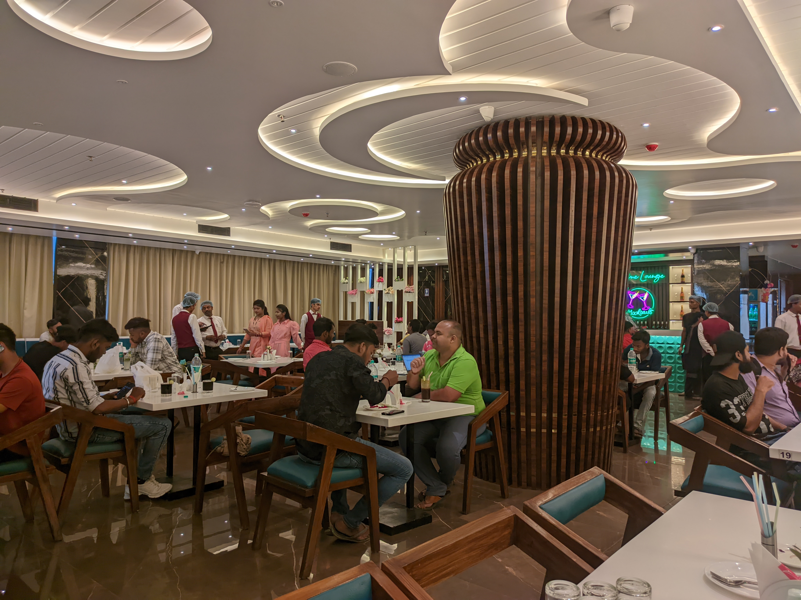

<div align="center">
  
  
  
  
[](https://twitter.com/intent/follow?screen_name=codewithsadee_)
  [](https://youtu.be/CjVGp5kGHxA)

  <br />
  <br />

  <h2 align="center">Grilli - Restaurant Website</h2>

Grilli is a fully responsive restaurant website, <br />Responsive for all devices, build using HTML, CSS, and JavaScript.

<a href="https://codewithsadee.github.io/grilli/"><strong>➥ Live Demo</strong></a>

</div>

<br />

### Demo Screeshots


### Prerequisites

Before you begin, ensure you have met the following requirements:

- [Git](https://git-scm.com/downloads "Download Git") must be installed on your operating system.

### Run Locally

To run **Grilli** locally, run this command on your git bash:

Linux and macOS:

```bash
sudo git clone https://github.com/codewithsadee/grilli.git
```

Windows:

```bash
git clone https://github.com/codewithsadee/grilli.git
```

### Contact

If you want to contact with me you can reach me at [Twitter](https://www.twitter.com/codewithsadee).

### License

[MIT](https://choosealicense.com/licenses/mit/)

//From index.html

<!--
        - #SERVICE
      -->

        <section
          class="section service bg-black-10 text-center"
          aria-label="service"
        >
          <div class="container">
            <p class="section-subtitle label-2">Flavors Of Dada Boudi</p>

            <h2 class="headline-1 section-title">We Offer Top Class Food</h2>

            <p class="section-text">
              We delight in serving delicious Kolkata style Biriyani along with
              traditional Bengali Thali and other Chinese and Tandoor item
            </p>

            <ul class="grid-list">
              <li>
                <div class="service-card">
                  <a href="#" class="has-before hover:shine">
                    <figure
                      class="card-banner img-holder"
                      style="--width: 285; --height: 336"
                    >
                      
                    </figure>
                  </a>

                  <div class="card-content">
                    <h3 class="title-4 card-title">
                      <a href="#">Indian</a>
                    </h3>

                    <a href="#" class="btn-text hover-underline label-2"
                      >View Menu</a
                    >
                  </div>
                </div>
              </li>

              <li>
                <div class="service-card">
                  <a href="#" class="has-before hover:shine">
                    <figure
                      class="card-banner img-holder"
                      style="--width: 285; --height: 336"
                    >
                      
                    </figure>
                  </a>

                  <div class="card-content">
                    <h3 class="title-4 card-title">
                      <a href="#">Chinese</a>
                    </h3>

                    <a href="#" class="btn-text hover-underline label-2"
                      >View Menu</a
                    >
                  </div>
                </div>
              </li>

              <li>
                <div class="service-card">
                  <a href="#" class="has-before hover:shine">
                    <figure
                      class="card-banner img-holder"
                      style="--width: 285; --height: 336"
                    >
                      
                    </figure>
                  </a>

                  <div class="card-content">
                    <h3 class="title-4 card-title">
                      <a href="#">Tandoor</a>
                    </h3>

                    <a href="#" class="btn-text hover-underline label-2"
                      >View Menu</a
                    >
                  </div>
                </div>
              </li>
            </ul>

            
            
          </div>
        </section>

        <!--
        - #ABOUT
      -->

        <section
          class="section about text-center"
          aria-labelledby="about-label"
          id="about"
        >
          <div class="container">
            <div class="about-content">
              <p class="label-2 section-subtitle" id="about-label">Our Story</p>

              <h2 class="headline-1 section-title">
                Every corner of the wall has it's own story
              </h2>

              <p class="section-text">
                Lorem Ipsum is simply dummy text of the printingand typesetting
                industry lorem Ipsum has been the industrys standard dummy text
                ever since the when an unknown printer took a galley of type and
                scrambled it to make a type specimen book It has survived not
                only five centuries, but also the leap into.
              </p>

              <div class="contact-label">Book Through Call</div>

              <a
                href="tel:+919831318010"
                class="body-1 contact-number hover-underline"
                >+91 9831318010</a
              >

              <a href="#" class="btn btn-primary">
                <span class="text text-1">Read More</span>

                <span class="text text-2" aria-hidden="true">Read More</span>
              </a>
            </div>

            <figure class="about-banner">
              

              <div
                class="abs-img abs-img-1 has-before"
                data-parallax-item
                data-parallax-speed="1.75"
              >
                
              </div>

              <div class="abs-img abs-img-2 has-before">
                
              </div>
            </figure>

            
          </div>
        </section>

        <!--
        - #SPECIAL DISH
      -->

        <section class="special-dish text-center" aria-labelledby="dish-label">
          <div class="special-dish-banner">
            
          </div>

          <div class="special-dish-content bg-black-10">
            <div class="container">
              

              <p class="section-subtitle label-2">Special Dish</p>

              <h2 class="headline-1 section-title">Mutton Biriyani</h2>

              <p class="section-text">
                Kolkata style mutton biriyani is the most significant item of
                Dada Boudi Hotel.
              </p>

              <div class="wrapper">
                <span class="span body-1">₹340.00</span>
              </div>

              <a href="#" class="btn btn-primary">
                <span class="text text-1">View All Menu</span>

                <span class="text text-2" aria-hidden="true"
                  >View All Menu</span
                >
              </a>
            </div>
          </div>

          

          
        </section>
